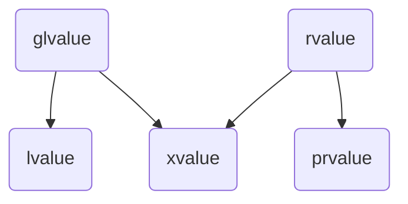

## Problem 1: Program Input and Output

##### Basic I/O
Providing input to the program:
- Invoke the program with a sequence of args: `./programname arg1 arg2 ... argn
- Invoke the program, input from stdin: `./programname`

Streams:
- Input stream: `std::cin`
- Output stream: `std::cout`

I/O Operators:
- Input operator: `<<`
- Output operator: `>>`

##### File I/O
File streams:
- Input file stream: `std::ifstream`
- Output file stream: `std::ofstream`

	**NOTE: stream input SKIPS whitespace by default -> to turn off, apply flag: `f >> std::noskipws`**

Opening and Closing Files:
- No explicit calls are made to file open/close
- Initializing `f{"name-of-file"}` opens the file
- When `f`'s scope ends, the file is closed

	**NOTE: you cannot write a function that takes input as an: `istream`**

##### References
L-Value References:
- Must be initialized, particularly to something that has an address
- Could appear on the left side of assignments

R-Value References:
- Can not appear on the right side of assignments

Things you **CANNOT** do:
- Create a pointer to a reference: `int &*x;` -> wrong!
- Create a reference to a reference: `int &&r = p;` -> will compile, but means something different!
-  Create an array of references: `int &r[3] = {_, _, _};` -> similar to pointer to ref!
- Call a function taking a ref with a literal
	- `void f(int &n); f(5);` -> can't initialize l-value ref to a literal value

Things you **CAN** do:
- Pass ref as function parameters: `void inc(int &x);` -> const pointer to the arguement
- Assume a really big struct exists: `struct ReallyBig{...}`
	- `void f(ReallyBig rb) {...}` -> pass-by-value, copies the struct (slow)
	- `void g(ReallyBig &rb) {...}` -> pass-by-ref, no copy, but function could propagate changes to the caller
	- `void h(const ReallyBig &rb) {...}` -> pass-by-ref, no copy, function can't change the passed rb
* Call a function taking a const ref with a literal 
	* `void g(const int &n); g(5);`-> since n can never change, compiler allows it and the literal is on the stack

	**NOTE: prefer pass-by-const-ref over pass-by-value for anything larger than a ptr, unless function needs to copy anyways**

## Problem 2: Separate Compilation
##### Creating a module
```c++
echo.cc: // module interface file

export module echo; // defines a module
import <iostream>;
export void echo(istream &f);

echo-impl.cc: // module implementation file

module echo; // declares that this file will be implementation of echo, all exported functions are known
void echo(istream &f) { ... }

main.cc: // client file

import<iostream>;
import<fstream>;
import echo;

int main(int argc, char *argv[]) {
	... echo(cin) ...
	... echo(cout) ...
}
```

##### Compiling Order
- Must be compiled in dependency order: module interface -> module implementation -> client
	- `g++20h iostream fstream`
	- `g++20m -c echo.cc`
	- `g++20m -c echo-impl.cc`
	- `g++20m -c main.cc`
	- `g++20m *.o -o mycat`

## Problem 3: Linear Collections and Modularity
##### Allocating Memory in C++
- Do not use malloc/free
- Use new/delete: `Node *n = new Node; delete n;`
	- Give it a type and it will allocate enough memory for that

##### Namespaces
- Allow multiple modules to have the same names and parameters
```c++
test.cc

export module test;

namespace Test{
	export int f(int x);
}

test-impl.cc

module test;
int Test::f(int x) { ... };
```
- Namespaces are open, anyone can add items to any namespace
	- Except adding to namespace std is not permitted

## Problem 4: Linear Collections and Memory Management
##### Arrays
- Creating arrays:
	- `int a[10];` -> creates array on the *stack*, fixed size
	- `int *p = new int[10];` -> creates array on the *heap*, fixed size
- Deleting arrays:
	- `delete [] p`
	- In general, use `new []` with `delete []`, mismatching these causes undefined behaviour

- What if array isn't big enough? No realloc for new/delete
	- Use abstraction to solve the problem with `vector`
	- Has an internal array and manages the memory on its own, increasing cap and copying array when needed

	**NOTE: `type &f(type arg)` returns a reference to item of type, allowing for mutation**

##### Argument-Dependent Lookup (ADL)
- Also called Koenig lookup
- If a function takes an argument in a namespace, it is allowed to look in that namespace for the particular function
- If the type of a function f's argument x belongs to a namespace n, then C++ will search the namespace n, as well as the current scope for a function matching f

## Problem 5: You're Doing It Wrong!
##### Introduction to Classes
- **Classes**: structs that contain functions
- **Methods**: functions that are inside structs
- **Objects**: instances of a class

- Methods differ from functions functions in that methods take an implicit param called `this`
	* `this` is a pointer to the receiver object
	* Fields of the receiver object can be accessed without needing to use `this->field`

##### Object Creation
###### Initializing Objects
- **Constructor**: method with the same name as class
- Initialize assuming constructor is defined:
	- On stack: `Example e{1, 2, 3};` or `Example e = Example{1, 2, 3};` (equivalent)
	- On heap: `Example *e = new Example{1, 2, 3};`

- Once a constructor is defined, C-style field initialization (default) is no longer enabled
- Advantages of constructors:
	- Can specify default parameters
	- Allows for overloading (multiple different constructors)
	- Sanity checks (validity of arguments passed)

- Every class comes with a built-in default (zero-arg) constructor -> default constructs all fields that are objects
- Ex. `Example e;` calls default constructor
- This default constructor goes away if you write any constructor

###### Object Creation Steps
1. Space is allocated
2. (will explore later)
3. Fields are constructed in declaration order -> field constructors are called for fields that are objects
4. Constructor body runs

	**NOTE: field initialization should happen in step 3, but ctor body is in step 4 -> consequence is object fields could be initialized twice; solution: MIL**

###### Member Initialization List (MIL)
- New syntax:
```c++
struct Example {
	String e1;
	int e2, e3;
	
	Example(string e1, int e2, int e3) : e1{e1}, e2{e2}, e3{e3} {}
}
```
- Object creation steps:
	- Step 3: `e1{e1}, e2{e2}, e3{e3}`
	- Step 4: `{}`
- MIL **must** be used for fields that are constants, references, and objects without a default ctor

Careful - Single-Arg Constructors:
- Single arg constructors create implicit conversions
```c++
struct Node {
	...
	Node(int data, Node *next = nullptr) : data{data}, next{next} {}
};

Node n{4}; // this is OK
Node n = 4; // this is OK... int implicitlly converted to Node
void f(Node n); f(4); // this is OK... may be trouble
```
- To stop this, define them explicitly:
```c++
struct Node {
	...
	explicit Node(...) : ... {}
}
```
- `explicit` keyword disables the implicit conversion

##### Object Destruction
Destroying Objects:
- **Destructor**: method that runs automatically when an object goes out of scope
- Built-in destructor: calls dtors on all fields that are objects
- Does NOT free any pointers

###### Object Destruction Steps
1. Dtor body runs
2. Fields destructed (dtor called on fields that are objects) in reverse declaration order
3. (will explore later)
4. Space deallocated

Writing Custom Dtors:
```c++
struct Node {
	...
	~Node() { delete next; }
};
delete n; // frees the entire list
```

## Problem 6: The Copier is Broken
##### Copying Objects
```c++
Node n = Node{1, Node{2, Node{3, nullptr}}};
Node m = n; // allowed, constructs m as a copy of n
```
- `Node m = n;` constructs m as a copy of n, invokes the copy ctor
- By default, makes a shallow copy -> minor annoyance when in scope, creates double-free error when trying to delete
```c++
struct Node {
	int data;
	Node *next;
	...
	Node(const Node &other) : data{other.data}, next {other.next ? new Node{*other.next} : nullptr} {}
}
```
- Need to pass by reference to copy ctor so it doesn't invoke copy... wouldn't make sense to copy calling copy

###### Copy Assignment Operator
```c++
Node n;
Node m;
m = n;
```
- This invokes a copy but not construction -> copy assignment operator
	- Compiler-supplied: copies each field (shallow), leaks m's old data
- Cannot simply copy other's data and then delete it -> it won't work in the case of self-assignment

###### Copy and Swap Idiom
```c++
import <utility>
struct Node {
	...
	void swap(Node &other) {
		using std::swap;
		swap(data, other.data);
		swap(next, other.next);
	}
	Node &operator=(const Node &other) {
		Node tmp = other;
		swap(tmp);
		return *this;
	}
};
```
* `std::swap(a, b);`: exchanges the values of a and b

## Problem 7: Thievery
R-Value References:
- `Node &&` is a reference to a temporary object (rvalue) of type Node

##### Moving Objects
###### Move Constructor
```c++
struct Node {
	...
	Node(Node &&other) : data{other.data}, next{other.next} {
		other.next = nullptr;
	}
};
```
* Copies other's data, and then delete's other's ptrs

	**NOTE: move runs in constant time vs linear time of copying**

###### Move Assignment Operator
```c++
struct Node {
	...
	Node &operator=(Node &&other) {
		swap(data, other.data);
		swap(next, other.next);
		return *this;
	}
};
```
1. Steal other's data
2. Destroy my old data
- Easy to do: swap without copy
	- Swap exchanges values through a temp variable

###### Combined Copy and Move Assignment
```c++
struct Node {
	...
	Node &operator=(Node other) {
		swap(other);
		return *this;
	}
};
```
- This impl uses a unified assignment operator
- Takes arg as pass-by-value
	- Invokes copy ctor if arg is an lvalue
	- Invokes move ctor if arg is an rvalue
	- => copies if and only if arg is an lvalue

Important to Know:
- If you don't define move operations, copy operations will be used
- If you do define them, they replace copy operations whenever the arg is temporary (rvalue)

###### Copy/Move Elision
```c++
vector makeAVector() { return vector{}; }
vector v = makeAVector();
```
- Just the basic ctor runs, no copy/move
	- In many circumstances (including this one), compiler must skip calling the copy/move ctors
	- `makeAVector()` writes its result directly into the space occupied by v in the caller, rather than copy it later

Other Examples of Elision:
```c++
vector v = vector{};
```
- Looks like a basic ctor of a temporary and a copy/move construction
	- Compiler is required to **not** make a temporary here, so no copy/move ctor is done, basic ctor only, written right into v
```c++
void doSomething(vector v);
doSomething(makeAVector());
```
- Result of makeAVector written directly into the param, no copy
	- This happens even if dropping ctor calls would change the behaviour of the program (ie. the ctor prints something)

	**NOTE: does not mean copy/move ctors don't get run, just not as often as you'd expect**

##### C++ Value Categories

glvalues:
- Denote a storage location ("generalized location")

lvalues:
- Can be on the left-hand-side of an assignment
	- Vars (including const), field references, array lookups, ptr derefs, etc.

rvalues:
- Can't be on the left-hand-side of an assignment
	- Address cannot be taken

prvalues:
- "pure rvalues"
	- Do **not** denote storage locations
	- Ex. literals, arithmetic expressions, function calls with non-ref return types
	- Most rvalues you would come up with are prvalues

xvalues:
- "expiring values"
	- Considered both rvalues and glvalues
	- Can't take its address but does denote a location
	- Ex. `std::move(...)` or `f(...)` returning an rvalue ref
	- "lvalue construction on rvalues"

General rules:
- prvalues do not generate temporaries (so no copy/move happens)
	- Only xvalues generate temps
- Only xvalues get moved from, only xvalues and lvalues get copied from

Named Return Value Optimization:
- Some situations allow for elision, but it is not required:
```c++
vector f() {
	vector v = makeAVector();
	... // changes to v
	return v; // not a prvalue -> could be elided, but not required
}

vector g() {
	vector v = makeAVector();
	vector w = makeAVector();
	... // changes to v and w
	if (...) return v;
	else return w; // no way to know which one to put into stack frame and avoid temp, thus eliminating the temp may not always be possible
}
```

##### Summary - Rule of the Big 5
- If you need to customize any one of the following 5 operations... then you usually need to customize all 5:
	1. Copy ctor
	2. Copy assignment
	3. Dtor
	4. Move ctor
	5. Move assignment

## Problem 8: I Don't Like Change
##### Declaring Const Methods
- Add const after method signature, means methods will not modify fields
	- Can be called on const objects
```c++
struct vector {
	...
	size_t size() const;
	int &itemAt(size_t i) const;
}

void f(const vector &v) {
	v.itemAt(0) = 4;
}
```
- v is a const object
	- **Cannot** change n, cap, theVector
	- **Can** change items pointed at by the vector

##### Const Overloading
- Define multiple methods - one for use if object is const, one for use if object is not const
```c++
struct vector {
	...
	const int &itemAt(size_t i) const; // will be called if v is const
	int &itemAt(size_t i); // will be called if v is const
	...
}
```
- First const denotes return type, second const denotes promise that the method won't change the object, and thus can be called by const objects (can also be called by non-cosnt objects)

Inline:
- Keyword `inline` hints to compiler to place function call inline rather than on stack
	- Saves the cost of a function call
	- Doesn't have to listen, decides on its own even without inline
	- Method body inside class implicitly suggests inline

## Problem 9: Keep it a Secret to Everybody
##### Interfering with ADTs
1. **Forgery**: creating an object without using a ctor function
	- Not possible once we wrote ctors
2. **Tampering**: accessing the internals without using a provided interface function... still an issue
	- Need to provide and rely on abstractions that have invariants

##### Private and Public
- **Private** fields/methods are only accessible to the class itself
- **Public** fields/methods are accessible to anyone
- In a **struct**: defaults to public access
- In a **class**: defaults to private access

## Problem 10: Walk Faster
Design Patterns:
- Well-known solutions to well-studied problems, adapted to suit current needs

##### Iterator Pattern
- Efficient iteration over a collection without exposing the underlying structure
- Create a subclass, iterator, which needs the following:
	- Within the iterator class:
		- `iterator(...) : ... {}` - constructor
		- `bool operator!=(const iterator &other) const { ... }` - not equal operator
		- `type &operator*() { ... }` - dereference operator
		- `iterator &operator++() { ... }` - add 1 operator
	- Outside of iterator class, inside wrapper class:
		- `iterator begin() { ... }` - begin method, defines start of iterator
		- `iterator end() { ... }` - end method, defines end of iterator
- Iterator over const is different over iterator over non-const -> need a second iterator class
	- Exact same as above, new class `const_iterator`
	- Only difference is declare `const type &operator*() const { ... }`

Auto:
- `auto x = expr` keyword saves time for writing the desired type
- Gives x the same type as the expr's value
	- Faster because compiler does not need to do any type checking to see if it matches

###### Range-Based For Loops
```c++
for (auto n : l) {
	out << n << ' ';
}
```
- Available for any class that satisfies:
	1. Methods/functions **begin/end** (must be called begin/end) that return an iterator object (doesn't need to be called iterator)
	2. The iterator class must support unary `*`, prefix `++`, and `!=`
- Examples:
	- `for (auto n : l) ++n;` -> n declared by value, ++n will increment n, but not list items
	- `for (auto &n : l) ++n;` -> n declared by reference, ++n will increment list items
	- `for (const auto &n : l) ++n;` -> n declared by const reference, no copying but cannot be modified

Friendship:
- `friend` keyword gives class access to private attributes of friend class
- Advice: limit friends, it weakens encapsulation

## Problem 11: Now You've Gone Too Far
##### Raising Exceptions
- Raise an exception by doing `throw exception{};` which constructs an object of type exception and throws it

Try/Catch Blocks:
- Attempt code withing a `try { ... }` block
- If an exception is raised, catch it:
	- Catch a specific exception: `catch (exception &e) { ... }`
	- Catch all exceptions: `catch (...) { ... }` (literal `...` inside the brackets!)

Throw to Caller:
- The exception will propagate back through the call chain until a handler is found
	- Called unwinding the stack
	- If no handler is found, program aborts
	- Control resumes after the catch block (problem code is not retried)

What if Ctor Throws?
- Object is partially constructed
- Dtor will not run on partially ctored objects
- Ctor must clean up after itself and dtor the members that have already been ctored

What if Dtor Throws?
- Trouble - by default, program aborts immediately (`std::terminate` is called)
- If you really want a throwing dtor, tag it with `noexcept(false)`, but watch out...

## Problem 12: But I Want a Vector of Chars
##### Templates
```c++
template<typename T> class vector{
	size_t n, cap;
	T *theVector;
  public:
    vector();
    ...
    void push_back(T n);
    ...
}

template<typename T> vector<T>::vector() : n{0}, cap{1}, theVector{new T[cap]} {}
template<typename T> void vector<T>::push_back(T n) { ... }
```
- Generalize abstraction over types

	**NOTE: must put implementation in interface file, cannot put it in impl file** 

###### Semantics of Templates
- The first time the compiler encounters `vector<type1>` where `type1` is a type, it creates a version of the code for vector where `type1` replaces `T` and compiles the new class
- Same thing for every new `type2`, ...
	- Compiler can't do this unless it knows all the details about the class
	- So the implementation need to be available, ie. in the `.h` file
	- Can also write the method bodies inline

## Problem 13: Better Initialization
##### Initializer List Construction
```c++
#include <initializer_list>
template<typename T> class vector {
  public:
    vector();
    vector(size_t n, T i = T{}) : theVector{new T[n]}, n{n}, cap{n} {
	    for (size_t j = 0; j < n; ++j) {
		    theVector[j] = i;
	    }
	}
    vector(std::initializer_list<T> init) : theVector{new T[init.size()]}, n{init.size()}, cap{init.size()} {
	    size_t i = 0;
	    for (auto &t : init) theVector[i++] = t;
    } 
}
```
- Allows for true array-style initialization
```c++
vector<int> v {1, 2, 3, 4, 5}; // 1 2 3 4 5
vector<int> v; // empty
vector<int> v{5}; // 5
vector<int> v{3, 5}; // 3 5
vector<int> v(5); // 0 0 0 0 0
vector<int> v(3, 5); // 5 5 5
```
- Default constructors > initializer list constructors > other constructors
	- To get initializer list constructors to run, need brace bracket init
	- To get other constructors to run, need round bracket init
- Initializer contain items stored in contiguous memory (begin method returns a ptr)
	- Using one array to build another
- Initializer lists meant to be immutable, do not modify contents, do not use memory as standalone data structures
- **In general:** if you know how big your vector will be, you can save reallocation cost by requesting the memory up front

## Problem 14: Actually... I Want a Vector of Posns
Creating a Vector of Posns:
```c++
struct Posn {
	int x, y;
	Posn(int x, int y) : x{x}, y{y} {}
};

int main() {
	vector<Posn> v; // won't compile
	...
}
```
- Creating a vector of type Posn initializes the internal array of Posns... but Posn doesn't have a default ctor
- Need to separate memory allocation (Step 1) from object initialization (Step 2-4)

##### Allocation
```c++
void *operator new(size_t n)
```
- Allocate n bytes (no initialization), return `void *`
- In C: `void*` implicitly converts to any ptr type
- In C++: the conversion requires a cast

##### Initialization
```c++
new (addr) type
```
- "placement new"
- Constructs `type` object at `addr`, does not allocate any memory

##### Putting it Together
```c++
template<typename T> class vector {
	...
  public:
    vector() : n{0}, cap{1}, theVector{static_cast<T*> (operator new(cap * sizeof(T)))} {}
    vector(size_t n, T x = T{}) : n{n}, cap{n}, theVector{static_cast<T*> (operator new(cap * sizeof(T)))} {
	    for (size_t i = 0; i < n; ++i) {
		    new (theVector ++i) T(x);
	    }
    }
	
	void push_back(T x) {
		increaseCap();
		new (theVector + (n++)) T(x);
	}
	void pop_back() {
		if (n) theVector[--n].~T(); // explicitely invoke the dtor
	}
	void clear() { while(n) pop_back(); }
	~vector() {
		clear();
		operator delete(theVector);
	}
}
```

## Problem 15: Less Copying
##### Template Functions
```c++
template<typename T> void swap(T &a, T &b) {
	T tmp {std::move(a)};
	a = std::move(b);
	b = std::move(tmp);
}
```
- As with template classes, the type arg can be omitted if C++ can deduce it from the types of args

###### Variadic Templates
```c++
template<typename T> class vector {
  public:
	template<typename... Args>
	void emplace_back(Args... args) {
		increaseCap();
		new (theVector + n++) T(args...);
	}
};
```
- `...` signifies variable number
- `Args` is a sequence of type variables denoting the types of the actual arguments
- `args` is a sequence of program variables denoting the actual args

###### How to Take Args by Reference?
```c++
template<typename... Args> void emplace_back(Args &&... args) {
	increaseCap();
	new (theVector + (n++)) T{args...};
}
```
- `Args &&` is a universal reference, can bind to an lvalue or an rvalue
- When is a reference universal? Must have the form `T&&` where `T` is a type arg being deduced for the current template function call
```c++
template<typename T> class C {
  public:
    template<typename U> void g(U &&x); // universal
    template<typename U> void h(const U &&x); // not universal
    void k(T &&x); // not universal
}
```

Preserving lvalue/rvalue Information:
- Don't know if args are lvalues, rvalues, or a mix -> want to call move on args iff args are rvalues
```c++
template<typename... Args> void emplace_back(Args &&... args) {
	increaseCap();
	new (theVector + (n++)) T (std::forward<Args>(args)...);
}
```
- `std::forward` calls move if arg is an rvalue ref, else does nothing
- This allows for args to be passed to T's ctor with lvalue/rvalue information preserved, called **perfect forwarding**

Shorthand Auto Notation for Template Functions:
- If you see a function with an argument of type `auto`, that function is a template:
```c++
auto max(auto x, auto y) { ... }
// is equivalent to
template<typename T1, typename T2> auto max(T1 x, T2 y) { ... }
```

## Problem 16: Memory Management is Hard
##### Exception Safety
- Raising and handling an exception should not corrupt the program
- Leaks are a corruption of the program's memory -> will eventually degrade performance and crash the program

What Constitutes Exception Safety? 3 Levels:
1. Basic guarantee
	- Once an exception has been handled, the program is in some valid state
	- No leaked memory, no corrupted data structures, all variants are maintained
2. Strong guarantee
	- If an exception propagates out of a function f, then the state of the program will be as if f had not been called
	- f either succeeds completely or not at all
3. No-throw guarantee
	- A function offers the no-throw guarantee if it never emits an exception and always accomplishes its purpose

##### Unique Pointers
- "Owns" the memory it holds
- Wrapper around a pointer that deletes the pointer inside of its dtor, called every time it goes out of scope
- Unique ptrs cannot be copied, can be moved
	- If unique ptrs were copied, 2 pointers to the same object
	- When it goes out of scope, both try to delete it -> cause double free

```c++
template<typename T> class unique_ptr {
	... 
  public: 
	... 
	unique_ptr(const unique_ptr &other) = delete; 
	unique_ptr &operator (const unique_ptr &other) = delete; 
	// this is how copying of streams is prevented
	unique_ptr (unique_ptr &&other): p{other.p} { 
		other.p = nullptr;
	} 
	unique_ptr &operator=(unique_ptr &&other) {
		delete p;
		p = other.p;
		other.p = nullptr;
		return *this; 
	} 
};
```
*  `= delete` removes the copy operators

Emplacement for `unique_ptr`s:
```c++
template unique_ptr make_unique(Args&&... args) { 
	return unique_ptr<T>{ new T{ std::forward(args)... }};
}

// ex:
auto p = make_unique<Posn>(1,2);
```

##### Resource Acquisition Is Initialization (RAII)
- Any resource that must be properly released (memory, file handles, etc.) should be wrapped in a stack-allocated object whose destructor frees it
- **DO NOT** allocate a `unique_ptr` on the heap -> defeats the purpose
- `unique_ptr`, `ifstream`
	- Acquire the resource when the object is initialized
	- Release it when the object's dtor runs

## Problem 17: Is Vector Exception-Safe?
- Current implementation: NO!
- Want to modify some methods to ensure it is exception-safe

Moving if No Exception:
- `std::move_if_no_except(x)` 
	- Produces `std::move(x)` if x has a non-throwing move ctor
	- Produces x otherwise

Telling Compiler NoExcept:
- `noexcept` keyword lets compiler know that a function/method is non-throwing
- In general, `move` and `swap` should be non-throwing

**Q:** Is `std::swap` NoExcept?
```c++
template <typename T> void swap(T &a, T &b) ____________ { 
	T c (std::move(a)); 
	a = std::move(b); 
	b = std::move(c); 
}
```

**A:** Only if T has a noexcept move ctor and move assignment. Thus the blank should be filled with:
```c++
noexcept(std::is_nothrow_move_constructible::value && std::is_nothrow_move_assignable::value)
```
- `noexcept(True)` is the same as `noexcept`

## Problem 18: Inserting/Removing From the Middle
- Inserting into lists is linear (no shuffling cost)
- Inserting into vectors is linear (with shuffling cost -> unavoidable)

Inserting With Iterators:
- Considerably faster for lists
```c++
template <typename T> class Vector { 
  public: 
    iterator insert(iterator posn, const T &x) { 
	    ptrdiff_t offset = posn - begin();
	    increaseCap();
	    iterator newPosn = begin() + offset;
	    new (end()) T(std::move_if_noexcept(* (end()-1)));
	    ++vb.n;
	    
	    for (iterator it = end() - 1; it != newPosn; --it) { 
		    *it = std::move_if_noexcept(* (it-1)); 
		}
		
		*newPosn = x;
		return newPosn; 
	} 
};
```

Is This Exception Safe?
- Assuming T’s copy/move options are exception safe (at least basis guarantee) 
- May get a partially shuffled vector, but it will still be a valid vector

Impact on Iterators:
- Inserting elements can have an impact on iterators that appear after the inserted element due to the shift
- **Convention:** after a call to insert or erase, all iterators pointing after the point of insertion/erasure are considered invalid and should not be used
- Similarly if a reallocation happens -> all iterators pointing at the vector become invalid
	- Problem with push_back: if placement new throws after an allocation, the vector is the same, but iterators were invalidated!
	- To fix: don't throw away the old array until you have placed the item
```c++
void push_back(const T &x) {
	if (n == vb.cap) {
		vector_base<T> vb2 {2 * vb.cap};
		new (vb2.v + n) T(x);
		try {
			uninitialized_copy_or_move(vb2.v, vb2.v + n, vb.v);
		} catch (...) {
			vb2.v[n].~T();
			throw;
		}
		int m = n;
		clear();
		std::swap(vb, vb2);
		n = m + 1;
	} else ...
}
```

## Problem 19: A Case Study in Strings
Create a String Class:
```c++
class string {
	size_t size, cap;
	char *theString;
  public:
    const char *c_str() { // returns an equivalent C-style string O(1)
	    return theString; // must have theString[length] == '\0'
    }
}
```

##### Lexicographical Comparison (<=>)
- 3-valued comparison function: `operator<=>`
- Standard provides a class `std::strong_ordering` and constants `std::strong_ordering::{less, equal, greater}` that can be used as a result of comparisons
	- These results compare, respectively, as `{<, ==, >} 0`
- By default, `<=>` does lex comparison on fields (by declaration order) for free if you ask for it:
```c++
class Vec {
	int x, y;
  public:
    std::strong_ordering operator<=>(const Vec &other) const = default;
};

// or write it ourselves:

class Vec {
	int x, y;
  public:
    std::strong_ordering operator<=>(const Vec &other) const {
	    auto n = x <=> other.x;
	    return (n == 0) ? y <=> other.y : n;
    }
};
```
- But for string, default is ptr comparison, so we need to write out own:
```c++
class string {
	...
  public:
    std::strong_ordering operator<=>(const string &other) const {
	    for (size_t i = 0; i < min(n, other.n); ++i) {
		    if (theString[i] != other.theString[i]) {
			    return theString[i] <=> other.theString[i];
		    }
	    }
		
		return n <=> other.n;
    }
}
```
- Defining `<=>` gives `<`, `<=`, etc. for free
- But, issue with `==` and `!=`: always does a linear scan (slow)
	- Write a specialized `operator==` to compare lengths first, then do scan -> this will then be used for both `==` and `!=`


##### Optimizing the String Representation
- Short String Optimization (SS)
	- Use the space as an array of chars if n is small
	- n is the discriminator:
```c++
class string {
	size_t n;
	size_t cap;
	char *theString;
}
```
- Utilizing unions:
```c++
class string {
	struct S {
		size_t cap;
		char *theString;
	};
	size_t n;
	union {
		S s;
		char arr[sizeof(S)];
	};
};
```
- If n >= sizeof(s), use s, else use arr
	- How long of a string can we hold? 
		- 15 chars + null terminator since struct `S` takes 16 bytes
	- Trick: assuming big-endian architecture, store n last instead of first
		- If the string is short, first 3 bytes of n will be 0, so the first byte could be null-terminator
		- Gives 16 chars + null terminator

##### Extracting Substrings
- `string::substr` method creates a new string, writes those chars in it -> new heap allocation (or SSO)
- Can we do better? If we know the substr will not be mutated, or at least only shrink, consider:
```c++
class string_view {
	const char *start;
	size_t n;
};
```
- A non-owning slice of a string
	- Points to a position in an existing `string`, `char *` or `vector<char>`, plus length
	- No allocations, smaller than string -> pass-by-value is reasonable
	- Copy operations are trivial, no Big 5
- Methods to give `string-view`:
	- Iteration: `begin`/`end`- range-based loops
	- Extracting further substrings
		- `remove-prefix`/`remove-suffix` - modify the endpoints
		- `substr` - produce another `string-view`
	- Search: `find` - search for occurences

## Problem 20: Abstraction Over Containers
##### Transforming Containers Abstraction (Map)
```c++
template<typename T1, typename T2>
void transform(const vector<T1> &source, vector<T2> &target, T2 (*f)(T1)) {
	auto it = target.begin();
	for (auto &x : source) {
		*it = f(x);
		++it;
	}
}
```
- But what if you want to transform a list, or transform list<->vector
- Make the type variables stand for the iterators, not the container elements
```c++
template<typename InIter, typename OutIter, typename Fn>
void transform(InIter start, InIter finish, OutIter target, Fn f) {
	// same body
}
```
- `InIter`/`OutIter` can be any types that support `++`, `*`, `!=`, including ordinary ptrs
- `Fn` can be any type that supports function application
	- Ex:
```c++
class Plus {
	int n;
  public:
    Plus(int n) : n{n} {}
    int operator()(int m) { return n + m; }
};

Plus p{5};
p(7); // gives 12, Plus is a "function object"
```

##### Lambdas
- Lambda notation: `[capture list](parameter list) mutable? noexcept? {body}`
- Lambda semantics:
```c++
void f(T1 a, T2 b) {
	[a, &b](int x) { body; } (args)
}

// translated to:
void f(T1 a, T2 b) {
	class ______ {
		T1 a;
		T2 b;
	  public:
	    ______(T1 a, T2 &b) : a{a}, b{b} {}
	    auto operator()(int x) const { body; }
	};
	______{a, b}.operator()(arg);
}
```
- If the lambda is declared mutable, then `operator()` is not const
- Capture list provides access to selected variables in the enclosing scope

## Problem 21: What's Better Than One Iterator?
- Two iterators!

##### Ranges (Views)
- A range is anything with a `begin()` and `end()` producing iterator types -> vector is a range
- A range only needs to look like it is sitting on top of a container -> have the range fetch items on demand
- Ex. filter and transform:
	- Filter - on fetch: iterate through the range until you find an item that satisfies the predicate, then return it
	- Transform - on fetch: fetch an item x from the range below, then return f(x)
- These range objects are called views -> on demand fetching, no intermediate storage
```c++
import <ranges>;

vector v{1, 2, 3, 4, 5, 6, 7, 8, 9, 10};
auto x = std::ranges::views::transform(std::ranges::views::filter(v, odd), sqr);
```

##### Range Adapters
- These range functions take a second form: range adapters
	- `filter(pred)` and `transform(f)` - just supply the function, not the range
- These become callable objects, parameterized by a range
- Ex: `transfrom(f)(filter(pred)(R));`
- Then, operator `|` is defined so that `R|A` means `A(R)`
	- Ex: `B(A(R)) = B(R|A) = R|A|B`
	- Ex: `auto x = v | filter(odd) | transform(sqr);`

## Problem 22: Heterogeneous Data
##### Inheritance
- Superclass (or base class)
	- Defines a common interface
- Subclass (or derived class)
	- Inherits all members (fields and methods) from their superclass
```c++
class Book {
	String title, author;
	int length;
  public:
    Book(string title, string author, int length) : 
	    title{title}, author{author}, topic{topic} {}
    bool isHeavy() const { return length > 100; }
    string getTitle() const { return title; }
};

class Text : public Book {
	string topic;
  public:
    Text(string title, string author, int length, string topic) :
	    Book{title, author, length}, topic{topic} {}
	bool isHeavy() const { return length > 200; }
};
```
- Above doesn't work, subclasses cannot access private fields of superclass

Providing Access to Superclass Private Fields:
1. Make it protected
	- `protected` keyword gives access only to the class itself and any of its subclasses
	- Weakens encapsulation, cannot enforce invariants on protected fields
2. Provide protected getter and setter methods
	- Keep the fields private, but protected getters/setters
	- Allows parent class to enforce invariants
- **Preferred**: protected getters and setters

##### Updated Object Construction/Destruction Sequences
Construction:
1. Space is allocated
2. Superclass part is constructed
3. Fields constructed in declaration order
4. Ctor body runs

Destruction:
1. Dtor body runs
2. Fields destructed in reverse declaration order
3. Superclass part is destructed
4. Space deallocated

##### Type Compatibility
- Subclasses should be usable in place of superclasses
- However, it still acts as a superclass

Slicing:
- Slicing happens when trying to place a subclass into a superclass slot
- It keeps only the superclass part, and "slices off" the subclass part
```c++
Book b = Text {__, __, __, __}; // will act like a book, not a text

vector<Book> library;
library.push_back(Text{...}); // only the book parts get copied, not heterogeneous
```
- This is a consequence of stack-allocated objects, special to C++
	- Allocates just enough space to hold an object of type superclass, not enough for subclass
- Slicing happens even if they are of the same size`
- As a result, the object acts as a superclass
```c++
void f(Book books[]); // raw arrays
Text texts[] = {...};
f(texts); // legal, but never do -> array will be misaligned, will not act like array of Books
```


##### Polymorphism
True Heterogenous Collection
- Slicing does not happen through pointers
	- The choice of what kind of object's methods it uses is based on the type of the pointer (static type), not the object (dynamic type)
	- C++ design principle: if you don't use it, you shouldn't have to pay for it
- Define superclass method as virtual
- Override the method in the subclass
```c++
class Book {
	...
  public:
    ...
    virtual bool isHeavy() const {...}
};

class Text {
	...
  public:
    ...
    bool isHeavy() const override {...}
};
```
- `override` ensures the same method signature of a `virtual` method
```c++
vector<Book*> library;
library.push_back(new Book{...});
library.push_back(new Text{...});

int howManyHeavy(const vector<Book*> &v) {
	int count = 0;
	for (auto &b : v) {
		if (b->isHeavy()) ++count;
	}
	return count;
}
```
- Now, calling `isHeavy()` will be called on the correct object type, even if we don't know what is in the vector, and the items are probably not all the same
	- This is called **polymorphism**

##### Virtual Methods
Virtual methods are implementation-dependent, but the following is typical:
- Non-virtual methods -> ordinary function call

- If at least one virtual method:
	- Compiler creates a table of function ptrs, one per class (the **vtable**)
	- Each object contains a pointer to its class' vtable (the **vptr**)
	- Calling a virtual method -> following the ptr to the vtable, follow the function pointer to the correct function
	- vptr is often the first field, so that a subclass object looks like a superclass object and so the program knows where the vptr is
- Thus, virtual methods incur a cost in time (extra ptr deref) and in space (each object gets a vptr/vtable)
- If a subclass doesn't override a virtual method, its vtable will point to the superclass implementation

## Problem 23: I'm Leaking!
- Always make the dtor virtual in classes that are meant to be superclasses - even if the dtor does nothing. - you never know what the subclass might do, so you need to make sure its dtor gets called
- Also always give your virtual dtor an implementation - even if empty - it will get called by subclass dtor

If a class is not meant to be a superclass
- No need to incur the cost of virtual methods needlessly
- Leave the dtor non-virtual, but declare the class final
```c++
class X final {
	... // cannot be subclassed
};
```

## Problem 24: I Want a Class With No Objects
##### Abstract Classes
- Pure virtual methods are virtual methods with no implementation(`= 0`), forces subclasses to implement it
```c++
class Student {
  public:
	virtual float fees() const = 0; // pure virtual method
};

class RegularStudent : public Student {
  public:
    float fees() const override; // override of pure virtual method
};
```
- An abstract class is any class with a pure virtual method
- Abstract classes cannot be instantiated, but can point to instances of create subclasses
```c++
Student s; // wrong
Student *s = new Student; // wrong
Student *s = new RegularStudent; // OK
```
- Subclasses of abstract classes are abstract unless they implemesnt all pure virtual methods
- Used to organize concrete classes
- Can contain common fields, methods, and default implementations
- You can make any class abstract (if no other pure-virtual method exists) by making the destructor pure virtual, and then implementing it outside of the class
```c++
class AbstractBook {
	...
  protected:
    ...
  public:
    ...
    virtual ~AbstractBook() = 0; // pure virtual dtor
};

AbstractBook::~AbstractBook() {} // dtor implementation
```

## Problem 25: The Copier is Broken
- When subclasses add fields: be careful!
```c++
Book *b1 = new Book{...};
Book *b2 = new Text{...};

*b1 = *b2;
```
- Partial assignment is done, only the book part is copied - object is corrupted

1. Make `operator=` virtual
	- Issues could arise with mixed assignment
2. Make all superclasses abstract, `operator=` non-virtual
	- Makes `Abstract::operator=` not accessible to outsides, so thus no partial assignment and `*b1 = *b2` will not compile

## Problem 26: I Want to Know What Kind of Book I Have
- C++ has 4 casting operators:

##### static_cast
- `static_cast` is used for conversions with well-defined semantics
```c++
void f(int a);
void f(double b);
int x;
f(static_cast<double>(x)); // calls the second f
```
- Can also cast superclass ptr to subclass ptr -> you have to really know that it is a subclass object, or else undefined behaviour
```c++
Book *b = new Text{...};
Text *t = static_cast<Text*>(b)
t->getTopic(); // works
```

##### reinterpret_cast
- `reinterpret_cast` is used for casts without well-defined semantics
- Unsafe, and implementation dependent
```c++
Book *b = new Book{...};
int *p = reinterpret_cast<int*>(b); // dangerous...
```

##### const_cast
- `const_cast` is used for adding/removing const
- The only C++ casting operator that can "cast away const"
```c++
void g(Book &b); // assume we know in this circumstance, g won't mutate b
void f(const Book &b) {
	g(const_cast<Book&>(b));
}
```

##### dynamic_cast
- `dynamic_cast` attempts to cast the object and if it fails, returns a nullptr
- Useful for when we don't know exactly what type of object we have -> static casting is not safe
```c++
Book *pb = ___;
Text *pt = dynamic_cast<Text*>(pb); // Text obj casted if pb is Text, nullptr otherwise

if (pt) { ... pt->getTopic() ...}
else ... // not a Text
```

Dynamic Reference Casting:
```c++
Book *pb = ___;
Text &t = dynamic_cast<Text&>(*pb);
```
- Okay if `*pb`, throws `std::bad_cast` otherwise
- Works by accessing an object's runtime type information (RTTI) - stored in the vtable for the class
	- Can only used `dynamic_cast` on objects with at least 1 virtual method
- Dynamic casting offers a possible solution to the polymorphic assignment problem in Problem 25:
	- With a virtual `operator=`, attempt to dynamic reference cast the incoming superclass object to the subclass object
	- Works if it is a subclass object, throws otherwise
	- Why is it better? Throws error at runtime vs. error at compile time
```c++
Text &Text::operator=(const Book &other) { // virtual
	const Text &tOther = dynamic_cast<const Text&>(other);
	Book::operator=(other);
	topic = tOther.topic;
	return *this;
}
```